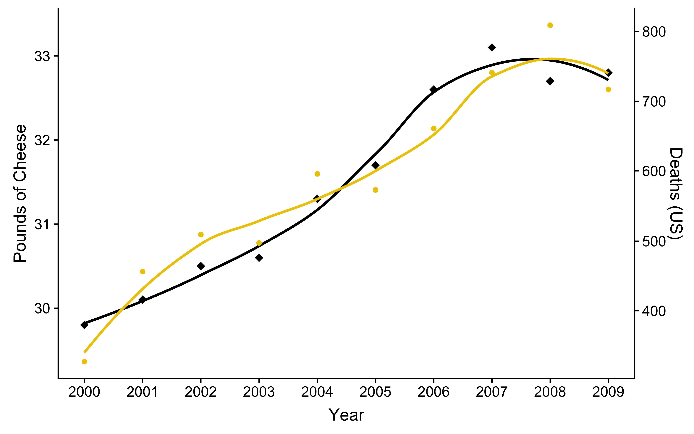
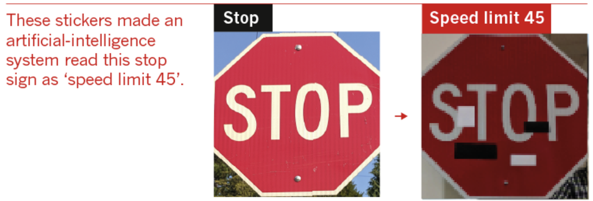

# P-hacking and abuse of machine learning: A cautionary tale

Presented at GitHub Universe - Education Day on Nov 15, 2019

## "I am a data scientist"

You probably have access to more digital information now than existed in the year you were born.

* Information will grow to about 40 Zettabytes by 2020
    * This is equivalent to 4 billion petabytes
    * Roughly 1/2 a petabyte per person on the earth today
* Given all of this data, we all need to be a little more data savvy

## Data Science Principles

"All models are wrong, but some are useful" - George Box

* Be honest with yourself and others
* Correlation is not causation
* Know your limits
* Question everything
* Just because you *can* doesn't mean you *should*

## Disclaimer

* The mistakes we are discussing today were made by talented people
* These principles make disaster *less* likely but don't eliminate the possibility
* We are all human - To err is human

## Be honest with yourself and others

P-hacking "occurs when researchers try out several statistical analyses and/or data eligibility specifications and then selectively report those that produce significant results." - Head et. al.

* Bad:
    * Choose methods and data based solely on model output and don’t report it
* Good:
    * Share exactly what you did with stakeholders
    * Validate any models that are subject to information bias

Impact: Relationship between models and the real world are biased

[The Extent and Consequences of P-Hacking in Science](https://doi.org/10.1371/journal.pbio.1002106), ML Head, L Holman, R Lanfear, AT Kahn, MD Jennions. March 13, 2015, PLOS Biology

## Correlation is not Causation

Per capita consumption of cheese in pounds (US) (USDA)

Number of people who died by becoming tangled in their bedsheets (US) (CDC)

See [Tyler Vigen's website](http://tylervigen.com/view_correlation?id=7) to see this example and other equally egregious examples of spurious correlations.

## Know your Limits

* What assumptions am I making?
* What shortcuts am I taking?
* What are the limitations of my data?

Elaine Herzberg was struck and killed by an autonomous car while pushing a bicycle across the road on March 18, 2018.

* Software failures
    * 6 seconds prior to impact Herzberg identified as unknown object
    * In the next 4.7 seconds Herzberg identified as another vehicle and then as a bicycle
    * 1.3 seconds prior to impact system determined that emergency braking was required
    * Operator was not alerted and the system did not brake
* Operator failures
    * Uber had recently decreased the number of operators from 2 to 1
    * The safety driver was watching Hulu

## Limits of Deep Learning

[Why deep-learning AIs are so easy to fool](https://www.nature.com/articles/d41586-019-03013-5), October 9, 2019, Nature

## Question Everything

* What assumptions am I making?
* How might those assumptions be violated?
* Assume that data are flawed until you convince yourself otherwise.
* Ask yourself, what else could go wrong?
* Test, test, test!

The European Space Agency was forced to manually detonate the Ariane 5 rocket on June 4, 1996, destroying the $7 billion project and its $500 million payload.

<iframe width="560" height="315" src="https://www.youtube.com/embed/gp_D8r-2hwk" frameborder="0" allow="accelerometer; autoplay; encrypted-media; gyroscope; picture-in-picture" allowfullscreen></iframe>

* Software failures
    * 16-bit code from the Ariane 4 rocket was reused
    * The Ariane 5 rocket provided 64-bit data during the launch

## Just because you *can* doesn't mean you *should*

"With great power comes great responsibility" - Uncle Ben

* Legality is where our responsibilities *start*.
* Think before you act.
* What are the consequences of what I am doing?

Cambridge Analytica used permissive Facebook policies to harvest data on millions of people. These data were then used to influence the 2016 US election.

* Facebook
    * did not directly contribute to the misuse of data
    * was fined $5 billion by the FTC for not sufficiently protecting data

[MINDF*CK: Cambridge Analytica and the Plot to Break America](https://www.amazon.com/dp/1984854631/ref=cm_sw_r_tw_dp_U_x_PWXYDbXT9N8MY) by Christopher Wylie provides an interesting and disturbing account.